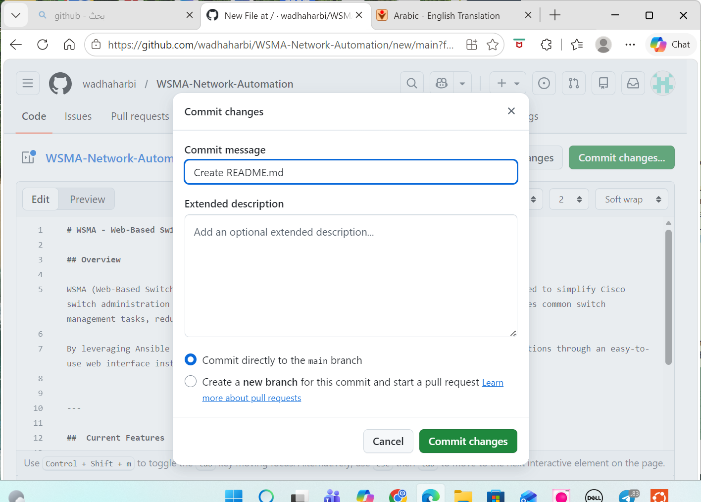

# WSMA - Web-Based Switch Management Automation

## Overview

WSMA (Web-Based Switch Management Automation) is a web-based network automation project designed to simplify Cisco switch administration using Ansible. The project provides a centralized interface that automates common switch management tasks, reducing manual configuration effort and improving operational efficiency.

By leveraging Ansible and SSH connectivity, network administrators can manage switch configurations through an easy-to-use web interface instead of manually entering commands on each device.

---

##  Current Features

- Create multiple VLANs in a single operation
- Automate VLAN deployment on Cisco switches
- Configure Port Security on switch interfaces
- Perform port shutdown and no shutdown operations
- Execute predefined network configuration templates
- Manage Cisco switches through SSH using Ansible
- Web-based management interface

---

##  Technologies Used

- Ansible
- Cisco IOS
- Ubuntu Linux
- SSH
- Python
- Git & GitHub

---

##  Future Enhancements

- Configuration Backup and Restore
- n8n Workflow Integration
- User and Role Management
- Enhanced Web Security
- Activity Logging and Monitoring

---
## 📸 Screenshots

### VLAN Automation

---

##  Author

- Ameera Albalawi 
- Sara Alshehri
- Madeeha Alotaibi
- Wadha Alharbi

Advanced Networking Technology Bootcamp - Tuwaiq Academy
